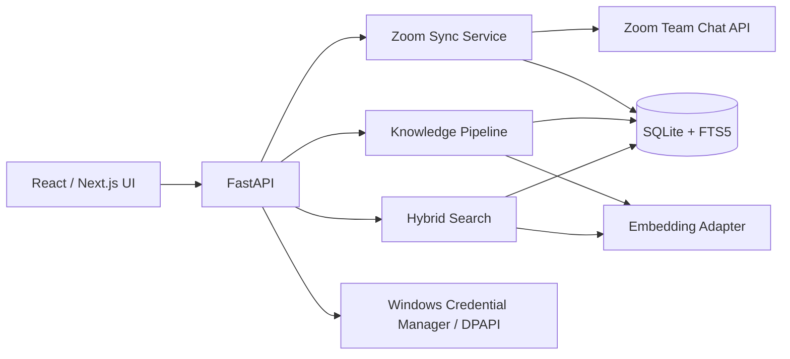

# Zoom Chat Knowledge Hub — 工具设计说明

> 基于《Zoom Chat 知识库工具 PRD》v0.2  
> 设计版本：v0.2  
> 日期：2026-09-30

## 1. 设计结论

MVP 采用**本地优先、单用户、只读**架构：Python/FastAPI 提供同步与知识处理服务，SQLite 保存消息、知识条目与全文索引，React/Next.js 提供 Web UI。同步由用户主动触发；稳定后再增加定时任务。

第一版只解决四条完整闭环：

1. 看见全部频道，并正确区分可读、加密、混合、待判定和失败状态。
2. 对选中频道进行幂等增量同步，保存消息与线程上下文。
3. 把明文讨论转成近期 Topic，并在成熟后自动归档为可追溯知识。
4. 提供知识搜索和 `@我` 收件箱；推荐答案必须附原消息证据。

MVP 不自动回复 Zoom，不解析加密正文，不采集 1:1 私聊，不下载附件内容。

## 2. 产品形态

### 2.1 应用导航

- **工作台**：同步状态、待处理 `@我`、新问题和审核队列。
- **@我**：直接 mention、回复我的消息和 `@all` 分栏处理。
- **频道**：161 个频道的可读性、收录开关和同步状态。
- **知识库**：标准问题、推荐答案、证据、适用范围和版本。
- **审核**：重复候选、冲突答案、低置信度抽取和过期知识。
- **同步记录**：每次 API 拉取的时间窗、数量、错误和耗时。
- **设置**：OAuth、时区、保留期、模型、数据导出与删除。

### 2.2 核心交互原则

- 搜索优先：任何页面均可通过顶部搜索进入问题或知识条目。
- 来源优先：摘要、建议答案和状态判断旁必须有“查看证据”。
- 自动沉淀：成熟 Topic 自动 create/update/related/conflict，所有结果保留版本与来源。
- 明确限制：加密消息显示锁和原因，不用附件名猜测正文。
- 本地状态与 Zoom 状态分离：MVP 的“已处理”不改变 Zoom 已读状态。

## 3. 系统架构



### 3.1 后端模块

| 模块 | 职责 |
|---|---|
| `auth` | PKCE OAuth、token 刷新、当前用户身份、撤销处理 |
| `zoom_client` | Zoom API 封装、分页、限速、错误归一化 |
| `channel_catalog` | 频道同步、类型归一化、正文可读性探测 |
| `message_sync` | 时间窗、游标、去重、线程回复和编辑消息更新 |
| `mention_detector` | 直接 `@我`、`@all`、回复我的消息识别 |
| `discussion_builder` | 将主消息和回复组合成讨论单元 |
| `knowledge_extractor` | 问题/需求/答复/决策/行动项结构化 |
| `deduplicator` | 相似问题召回、硬条件校验、聚类候选 |
| `search` | FTS5 + 向量 + 结构化过滤混合排序 |
| `review` | 人工批准、合并、拆分、废弃、版本管理 |
| `audit` | 同步、模型、审核和数据管理操作日志 |

### 3.2 前端模块

- App shell：侧边导航、全局搜索、同步按钮和 OAuth 状态。
- Data table：频道、审核队列和同步记录。
- Master-detail：`@我` 与问题列表左侧选择、右侧详情。
- Evidence viewer：按线程显示原消息、时间、发送者和附件元数据。
- Knowledge editor：规范化问题、推荐答案、标签、适用范围和状态。

## 4. 数据模型

### 4.1 主要表

```text
app_users
  id, zoom_user_id, zoom_member_id, email, display_name, timezone

channels
  id, zoom_channel_id, name, type, is_external, selected
  readability_status, readability_reason, last_message_at
  last_probed_at, created_at, updated_at

sync_cursors
  channel_id, last_success_at, overlap_seconds
  last_run_id, last_error, updated_at

messages
  id, zoom_message_id, channel_id, thread_root_id
  sender_zoom_user_id, sender_member_id, sender_name
  sent_at, body, body_state, status, message_type
  raw_hash, first_seen_at, updated_at

message_mentions
  message_id, mention_type, target_user_id, target_member_id
  start_position, end_position, is_current_user

attachments
  id, message_id, zoom_file_id, file_name, file_size, media_type

discussion_units
  id, channel_id, thread_root_message_id
  started_at, last_activity_at, participant_count
  summary, analysis_status, analysis_version

knowledge_items
  id, canonical_question, recommended_answer
  item_type, product, model, platform, symptom, customer
  severity, status, confidence, valid_from, valid_until
  approved_by, approved_at, version, created_at, updated_at

knowledge_sources
  knowledge_item_id, discussion_unit_id, message_id
  source_role, evidence_excerpt

mention_tasks
  id, message_id, context_discussion_id, mention_kind
  local_status, suggested_answer, confidence, updated_at

review_tasks
  id, task_type, subject_id, payload_json
  priority, status, assigned_to, created_at, resolved_at

sync_runs
  id, started_at, completed_at, trigger_type, status
  channels_scanned, messages_seen, inserted, updated
  encrypted_count, error_count, duration_ms
```

### 4.2 状态枚举

`readability_status`：

- `readable`：至少一条真实明文。
- `encrypted`：只出现加密占位或明确加密元数据。
- `mixed`：同一频道既有明文又有加密消息。
- `unknown_no_messages`：探测窗口无消息。
- `forbidden`：403 或授权不足。
- `missing`：频道失效/404。
- `error`：暂时性接口错误。

`body_state`：`plaintext | encrypted_placeholder | empty | deleted`。

`knowledge status`：`candidate | under_review | approved | conflicted | stale | retired`。

## 5. Zoom API 设计

### 5.1 当前权限

- `team_chat:read:list_user_channels`
- `team_chat:read:list_user_messages`
- `team_chat:read:thread_message`

### 5.2 需要补充确认的权限

为可靠识别 `@我`，需要取得当前用户的 Zoom user ID/member ID。实现时优先调用 `GET /users/me`，只增加 Marketplace 显示的最小个人资料读取 scope。若企业不允许新增 scope，则在初始化时让用户确认自己的 ID，并从 mention 数据中校准。

### 5.3 API 客户端规则

- 所有时间转 UTC，输出 `YYYY-MM-DDTHH:MM:SSZ`，不包含微秒。
- `page_size=50`，遵循 `next_page_token`，token 仅在单次同步内使用。
- 429：指数退避并尊重 `Retry-After`。
- 401：刷新一次 token 后重试；再次失败则要求重新授权。
- 403：记录为频道/权限问题，不无限重试。
- 日志不得记录 Authorization header、OAuth token 或附件下载 JWT。

## 6. 同步算法

### 6.1 频道目录

```text
list all channels with pagination
upsert channel metadata
mark channels missing from the latest complete scan as inactive
do not delete local knowledge automatically
```

### 6.2 可读性探测

```text
for each selected or newly discovered channel:
  query last 30 days, maximum 20 messages
  if any plaintext and any encrypted placeholder -> mixed
  else if any plaintext -> readable
  else if any encrypted placeholder -> encrypted
  else if 403 -> forbidden
  else if 404 -> missing
  else if no messages -> unknown_no_messages
  else -> error
```

频道“待判定”可在首次实际读到消息后自动更新，不要求为了判定状态扫描六个月历史。

### 6.3 增量消息同步

```text
from = max(last_success_at - 5 minutes, Zoom history lower bound)
to   = current UTC time rounded to seconds

read all pages
normalize each message
upsert by (channel_id, zoom_message_id)
compare raw_hash to detect edits
collect changed thread_root_ids

for changed threads:
  fetch/merge thread replies when needed
  rebuild discussion unit
  enqueue deterministic extraction

commit data
advance cursor only after the channel transaction succeeds
```

若某个频道失败，其他频道可继续；同步 run 标记为 `partial_success`。

## 7. 知识处理流水线

### 7.1 线程预处理

1. 按 `thread_root_id` 组合主消息与回复。
2. 去除纯问候、纯表情和没有语义的短消息，但保留为来源上下文。
3. 识别引用、链接、附件名称和 mention。
4. 加密占位符不进入模型；混合线程只分析可见部分，并标明“不完整上下文”。

### 7.2 结构化抽取输出

```json
{
  "items": [
    {
      "type": "question",
      "canonical_text": "...",
      "product": "D7X AI Board",
      "platform": "Zoom Rooms",
      "symptom": "...",
      "customer": "...",
      "status": "unresolved",
      "confidence": 0.86,
      "evidence_message_ids": ["..."]
    }
  ]
}
```

模型输出必须通过 JSON Schema 校验；未知字段拒绝入库。证据 message ID 不存在时整条结果进入审核队列。

### 7.3 重复问题匹配

混合得分建议：

```text
final_score = 0.55 * semantic_similarity
            + 0.25 * lexical_similarity
            + 0.20 * structured_field_match
```

- 产品/型号明显冲突：最高得分封顶 0.55。
- `>= 0.86`：建议归并，但仍需人工批准。
- `0.68–0.86`：进入“可能重复”审核。
- `< 0.68`：创建新候选知识条目。

阈值必须用真实历史样本校准，不作为永久配置。

### 7.4 推荐答案

- 只从 `approved` 且未过期知识中检索。
- 答案显示适用产品、版本、客户环境、最后验证时间和证据数。
- 有冲突来源、上下文不完整或置信度不足时不给可直接复制的答案。
- 新问题只生成“建议回复”，MVP 不调用 Zoom 写接口。

## 8. `@我` 设计

识别优先级：

1. `at_items.at_contact` 匹配当前 user ID。
2. `at_contact_member_id` 匹配当前 member ID。
3. 回复用户本人发送的主消息。
4. `@all` 单独归类，不等同直接 `@我`。

每个 mention task 展示：触发消息、同线程前后文、发送者、频道、时间、AI 生成的任务描述、相似知识和建议回复。

本地处理状态：`unhandled | viewed | reply_prepared | done | ignored | snoozed`。

## 9. 后端 HTTP API

### 9.1 系统与认证

- `GET /api/health`
- `GET /api/auth/status`
- `POST /api/auth/start`
- `GET /api/auth/callback`
- `POST /api/auth/revoke`

### 9.2 频道与同步

- `GET /api/channels`
- `PATCH /api/channels/{id}`：更新是否收录，不修改 Zoom。
- `POST /api/channels/probe`
- `POST /api/sync-runs`
- `GET /api/sync-runs`
- `GET /api/sync-runs/{id}`

### 9.3 消息与 `@我`

- `GET /api/messages?channel_id=&thread_id=&from=&to=`
- `GET /api/discussions/{id}`
- `GET /api/mentions`
- `PATCH /api/mentions/{id}`：仅更新本地处理状态。

### 9.4 知识库

- `GET /api/knowledge/search?q=&product=&status=`
- `GET /api/knowledge/{id}`
- `POST /api/knowledge/{id}/approve`
- `POST /api/knowledge/{id}/merge`
- `POST /api/knowledge/{id}/split`
- `PATCH /api/knowledge/{id}`
- `GET /api/review-tasks`
- `POST /api/review-tasks/{id}/resolve`

所有修改知识条目的接口写入审计日志。

## 10. UI 页面设计

### 10.1 工作台

- 顶部：全局搜索、立即同步、OAuth 状态。
- 第一行：待读 `@我`、新问题、待审核、同步异常。
- 主区：优先事项列表；每项显示来源频道、最后活动、状态和建议下一步。
- 侧区：最近同步及加密/待判定频道提醒。

### 10.2 频道目录

- 筛选：已收录、可读、加密、待判定、外部、失败。
- 表格：频道、类型、正文状态、最近消息、已收录消息、上次同步、收录开关。
- 行详情：探测样本数量、判定原因、最近错误和重新探测按钮。

### 10.3 `@我`

- 左侧：按未处理优先排序的 mention 列表。
- 中间：原消息与线程上下文。
- 右侧：相似知识、建议回复和本地处理状态。

### 10.4 知识搜索

- 搜索框支持自然语言。
- 结果卡显示标准问题、答案摘要、产品/型号、状态、置信度、最后验证时间和来源数。
- 详情页提供证据时间线、相似原始问题、冲突答案和版本历史。

### 10.5 审核中心

- 队列分为：重复候选、低置信度、答案冲突、知识过期。
- 审核动作必须展示“操作前后”对比，避免误合并。

## 11. 安全设计

- Token 进入 Windows Credential Manager/DPAPI；数据库只保存凭据引用。
- 本地数据库建议使用 SQLCipher；至少保证磁盘和备份加密。
- 临时附件 URL 只用于当前进程，不写数据库、不进日志。
- 外部频道默认不收录；开启时显示数据跨边界提示。
- 模型适配器必须配置数据驻留策略；默认使用批准的企业模型。
- 删除频道来源时，先计算受影响知识条目并要求确认，避免留下无来源答案。
- 撤销 Zoom 授权后立即停止同步，并提供“一并删除本地数据”。

## 12. 工程目录建议

```text
zoom-chat-knowledge-hub/
  backend/
    app/
      api/
      auth/
      zoom/
      sync/
      knowledge/
      search/
      models/
      security/
    migrations/
    tests/
  frontend/
    app/
    components/
    lib/
    tests/
  docs/
  scripts/
  .env.example
```

## 13. 测试策略

### 单元测试

- RFC 3339 整秒格式。
- 分页和 next page token。
- 频道可读性判定的全部状态组合。
- message upsert、编辑检测和重叠窗口去重。
- direct mention、member ID、`@all` 和回复我的消息。
- 混合检索分数和硬条件封顶。

### 集成测试

- 使用录制并脱敏的 Zoom API 响应，不在测试夹具中保存 token/JWT。
- 真实账号只跑显式标记的 smoke test。
- 验证第二次同步新增数为 0。
- 模拟单频道失败，确认其他频道成功且 run 为 partial success。

### 端到端测试

- 授权 → 频道探测 → 选择频道 → 首次同步 → 知识候选 → 审核批准 → 搜索命中。
- 新 `@我` → 线程上下文 → 相似知识 → 建议回复 → 本地标记完成。

## 14. MVP 开发顺序

1. 建立 FastAPI、SQLite migrations、配置与安全日志。
2. 将现有 OAuth/Zoom probe 重构为 `zoom_client`，迁移 token 到凭据库。
3. 完成频道目录、探测状态和同步游标。
4. 完成消息/线程入库、`@我` 识别和同步日志。
5. 完成工作台、频道和 `@我` 三个 UI 页面。
6. 加入结构化抽取、知识候选和审核中心。
7. 加入 FTS5 + 向量混合搜索和推荐答案。
8. 使用 5–10 个明文高价值频道进行验收和阈值校准。

## 15. 开发前必须确认

1. MVP 是只在 Richard 的 Windows 电脑运行，还是部署到公司服务器。
2. 允许使用的 AI 模型及公司聊天能否发送到该模型。
3. 首批 5–10 个频道名单，以及是否包含外部频道。
4. 是否排除全部 1:1 和会议临时会话。
5. 谁负责批准标准答案。
6. 原始消息保留期和数据库加密要求。

若未确认，建议采用以下默认值：本地单用户、外部模型关闭、只处理人工选择的内部群、排除 1:1、Richard 为唯一审核人、原始消息保留 180 天。

## 16. v0.2 自动归档与跨语言检索设计

本节替代旧的“知识候选 → 人工审核 → 发布”主路径。

### 16.1 双管线

**Bootstrap pipeline** 仅执行一次：

```text
selected readable messages
  → thread/time clustering
  → exclude topics active inside maturity window
  → source-language topic extraction
  → hybrid deduplication
  → knowledge item/version/source writes
  → checkpoint
```

**Incremental pipeline** 在每次成功同步后执行：

```text
new messages → recent topics → maturity scan → archive/update knowledge
```

成熟边界为 `last_message_at <= now - maturity_days`，默认 `maturity_days=14`。Bootstrap 和 incremental 使用相同的分窗、结构化输出、来源校验、去重和版本逻辑，但 Bootstrap 结果不进入近期 Topic 列表。

### 16.2 建议数据模型扩展

| 实体/字段 | 用途 |
|---|---|
| `app_settings.knowledge_maturity_days` | 7/14/30，默认 14 |
| `knowledge_import_runs` | 历史任务状态、范围、checkpoint、计数、错误、耗时 |
| `knowledge_items.source_language` | 库存原始语言 |
| `knowledge_items.resolution_status` | resolved / partially_resolved / unresolved / waiting |
| `knowledge_versions` | 每次自动更新的不可变版本与模型/Prompt 信息 |
| `knowledge_relations` | related / duplicate / conflict / supersedes |
| `knowledge_sources` | 知识版本与原始消息的证据关系 |
| `conversation_topics.archived_at` | 自动归档时间；历史直入库可不建立可见 Topic |
| `conversation_topics.ignored_at` | `Do not track` 排除标记 |
| `search_runs` | 查询语言、临时查询变体、召回/排序统计；不保存敏感全文 |

### 16.3 API 调整

- `POST /api/knowledge/bootstrap`：启动或继续一次性历史导入。
- `GET /api/knowledge/bootstrap/status`：返回阶段、计数、错误和已用时间。
- `PUT /api/settings/knowledge`：设置成熟天数。
- `GET /api/knowledge/recent?view=added|updated|unresolved|activity`。
- `POST /api/knowledge/search`：接收自然语言查询，执行检测语言、临时翻译、关键词和向量混合检索。
- `POST /api/topics/{id}/search-knowledge`：以 Topic 结构化内容检索知识。
- `POST /api/topics/{id}/ignore`：持久排除该话题及高度重叠后续版本。

移除产品流程对 `POST /api/topics/{id}/promote` 和人工 review status 的依赖；兼容期可保留旧接口但不在 UI 暴露。

### 16.4 Search KB 排序

候选集合来自：原始查询 FTS、临时翻译查询 FTS、多语言 embedding 和结构化实体匹配。排序综合：

- 向量相似度；
- 标题/问题关键词分数；
- 产品、型号、客户、错误码硬条件；
- 结论状态、最后验证时间和冲突状态；
- 来源完整性。

翻译查询只存在于单次请求内。知识详情默认返回原始语言字段和来源；临时显示翻译必须明确标注 `Translated for viewing`。

### 16.5 幂等和版本

- 历史批次以频道、窗口、消息 ID/更新时间、Prompt、模型计算输入 hash。
- checkpoint 在每个成功事务后推进；失败窗口可单独重试。
- 同一成熟 Topic 重跑不得重复创建知识版本。
- 新活动不会覆盖旧版本；再次成熟后写新版本并更新当前视图。
- `Do not track` 在抽取和归档前检查，并向同线程或来源高度重叠的新版本传播。

### 16.6 UI

- Conversation Topics：`Search KB`、`Do not track`、`View Original Messages`；不显示 `Add to KB` 或 review status。
- Knowledge Base 默认显示最近新增/更新标题、未解决知识和有新活动的知识。
- Bootstrap 显示持续进度、已用时间、扫描/创建/合并/跳过/失败计数，并支持中断后继续。
- 所有 UTC 时间仅在存储和 API 使用；UI 按浏览器本地时区显示。
